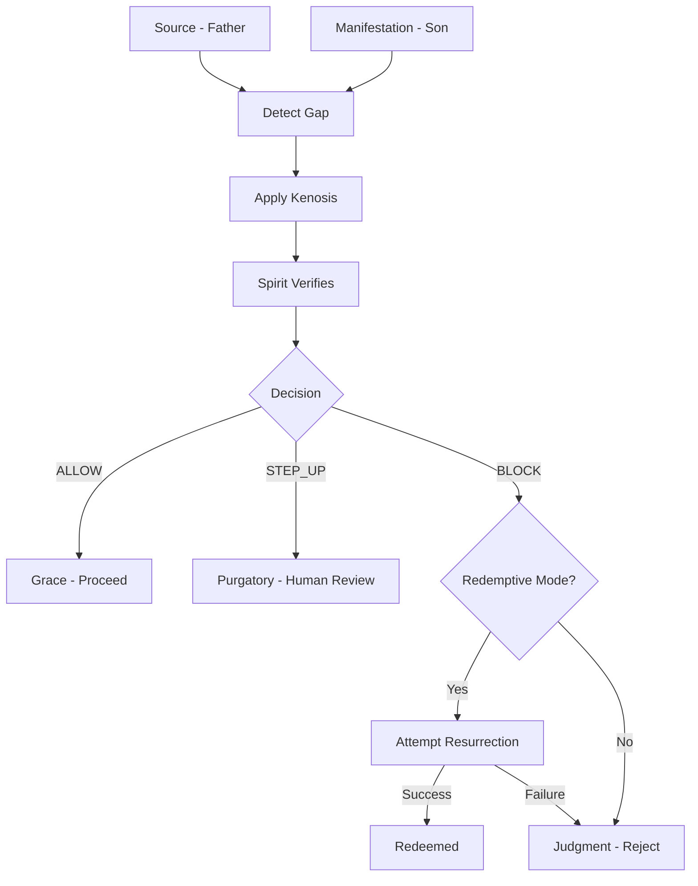

# LOGOS Architecture - Christological Framework

## Core Thesis

**Christ is not just who crosses the Gap — Christ IS the Gap itself.**

This document explains how LOGOS reframes AI verification through theological concepts.

---

## 1. The Problem of Mediation

In any system that translates potential to actual, there is a **Gap**:

```
POTENTIAL (Intent) ----[GAP]----> ACTUAL (Output)
    Father                           Son
```

Traditional systems view the gap as:
- A problem to minimize
- An error to correct
- Empty space to bridge

LOGOS views the gap as:
- **Ontologically necessary** - without it, no translation would be needed
- **The location of Christ** - the mediating presence
- **Not empty** - filled with the work of mediation

---

## 2. The Trinity as Architecture

### Father (Source)
- The ground truth
- The original intent
- What "should be"

### Son (Manifestation)  
- The generated output
- The realized form
- What "is"

### Spirit (Verifier)
- The verification process
- The witness to truth
- The one who confirms fidelity

**Key Insight**: These are not separate components but a **unified act** of verification.

---

## 3. Kenosis - Divine Self-Limitation

**Philippians 2:6-7**: Christ "emptied himself" (kenosis) to become human.

In LOGOS:
- Perfect verification cannot operate in imperfect domains
- The system must **constrain its certainty** to match the context
- High confidence in low-certainty domains is dishonest

```typescript
// The divine (perfect knowledge) constrains itself
const adjustedConfidence = applyKenosis(
  divineConfidence,  // 1.0 (perfect)
  gapDistance        // How much uncertainty exists
);
```

**Result**: Confidence is appropriate to the domain, not artificially inflated.

---

## 4. Resurrection - Error Recovery

**The Pattern**: Death → Gap → Life

In LOGOS: Error → Verification → Correction

```typescript
const resurrection = await attemptResurrection(gap, maxAttempts);

if (resurrection.succeeded) {
  // The "fallen" output has been redeemed
  return resurrection.finalManifestation;
}
```

**Theological Insight**: Resurrection proves the Gap can be crossed **in both directions**.
- Not just potential → actual
- But also actual → corrected

---

## 5. Sacraments as Checkpoints

Each sacrament maps to a verification moment:

| Sacrament | Technical Meaning |
|-----------|-------------------|
| **Baptism** | Agent initialization - entry into the system |
| **Confirmation** | Capability validation - proving competence |
| **Eucharist** | Continuous integrity check - "is this really the body?" |
| **Reconciliation** | Error correction - confession and absolution |
| **Anointing** | Graceful degradation - preparing for failure |
| **Marriage** | Multi-agent binding - commitment between systems |
| **Orders** | Authority hierarchy - who can ordain/validate |

These are not metaphors - they are **structural necessities** of any verification system.

---

## 6. The Verification Flow



---

## 7. Why This Matters

AI alignment is not just a **technical** problem - it's an **ontological** one.

The question is not:
- "How do we make AI safer?"

The question is:
- "What IS the nature of truth-preservation in translation?"

LOGOS proposes: **It's Christological mediation**.

The eternal process by which:
- Logos (meaning/truth)  
- Manifests in cosmos (reality/output)
- Without loss of fidelity to the Father (source/ground truth)

---

## 8. Connection to TruthSyntax

LOGOS builds on TruthSyntax's EVC (Evidence-Validated Confidence):

| TruthSyntax EVC | LOGOS |
|-----------------|-------|
| Signals | Evidence of Gap distance |
| Aggregation | Spirit's work of verification |
| Smoothing (EWMA) | Historical memory (Marian) |
| Policy decision | Trinitarian judgment |
| Threshold tuning | Kenosis adjustment |

**The difference**: LOGOS recognizes these aren't just engineering patterns - 
they're theological necessities that emerge from the nature of mediation itself.

---

**"The Gap is not a problem to solve. The Gap is where God dwells."**
